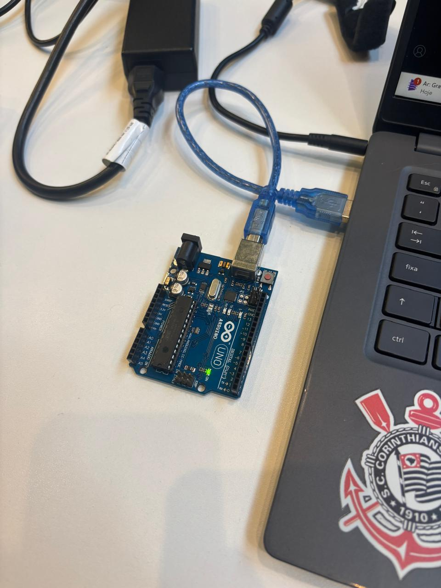
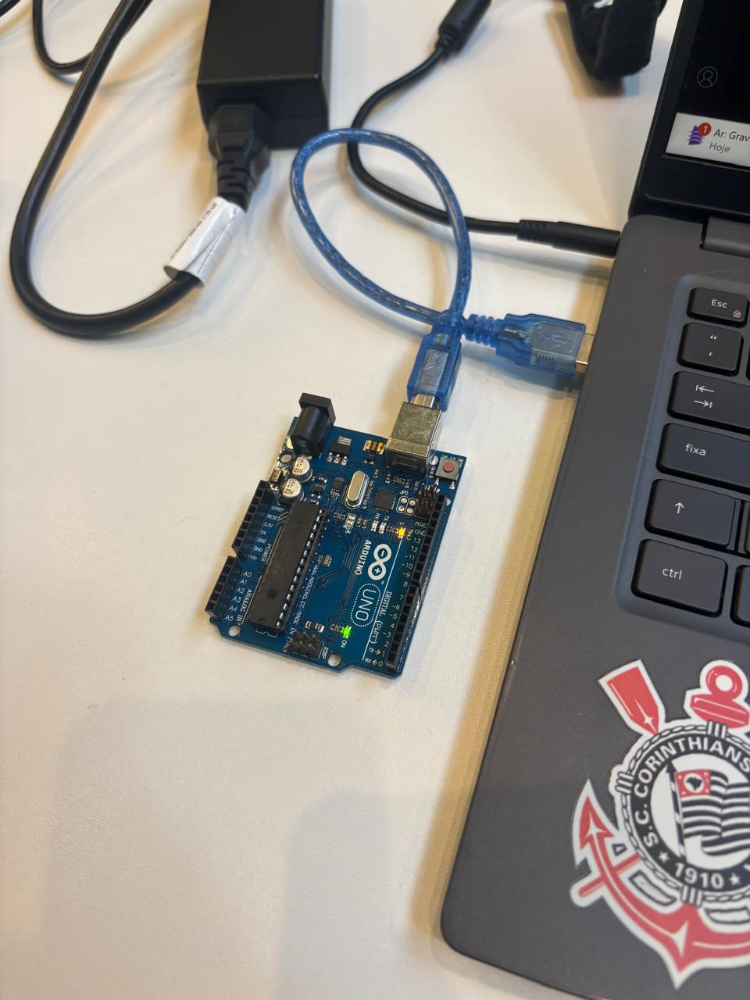

# Parte 1 — Blink LED Interno

Este diretório contém o sketch para acionar o LED interno do Arduino, piscando com X = 1s ligado e Y = 1s desligado.

- Arquivo principal: `blink_led_interno.ino`
- Como usar: Abra no Arduino IDE, selecione a placa/porta corretas e faça o upload.
- Evidências: Na pasta `assets/` estão fotos e vídeo da placa com o LED piscando.

## Código

Consulte o arquivo `.ino` deste diretório.

## Estrutura

```
Parte1_BlinkInterno/
├── blink_led_interno.ino
├── README.md
└── assets/
    ├── foto_led_apagado_interno.jpg
    ├── foto_led_piscando_interno.jpg
    └── video_led_interno.mp4
```


## Evidências

<div align="center">
<sub>Imagem 01: LED interno — apagado.</sub>

<sup>Fonte: Material produzido pelo autor, 2025.</sup>
</div>

<div align="center">
<sub>Imagem 02: LED interno — aceso (piscando).</sub>

<sup>Fonte: Material produzido pelo autor, 2025.</sup>
</div>

<div align="center">
<sub>Vídeo 01: LED interno piscando.</sub>
<a href="./assets/video_led_interno.mp4">Assistir ao vídeo (MP4)</a>
<sup>Fonte: Material produzido pelo autor, 2025.</sup>
</div>

<div align="center">
  <a href="https://drive.google.com/drive/folders/1nVI8vBpSVaPWIG039I8llvsmGIFWAjtf?hl=pt-br" target="_blank">
     Acessar vídeos e fotos no Google Drive
  </a>
  <sup>Fonte: Material produzido pelo autor, 2025.</sup>
</div>