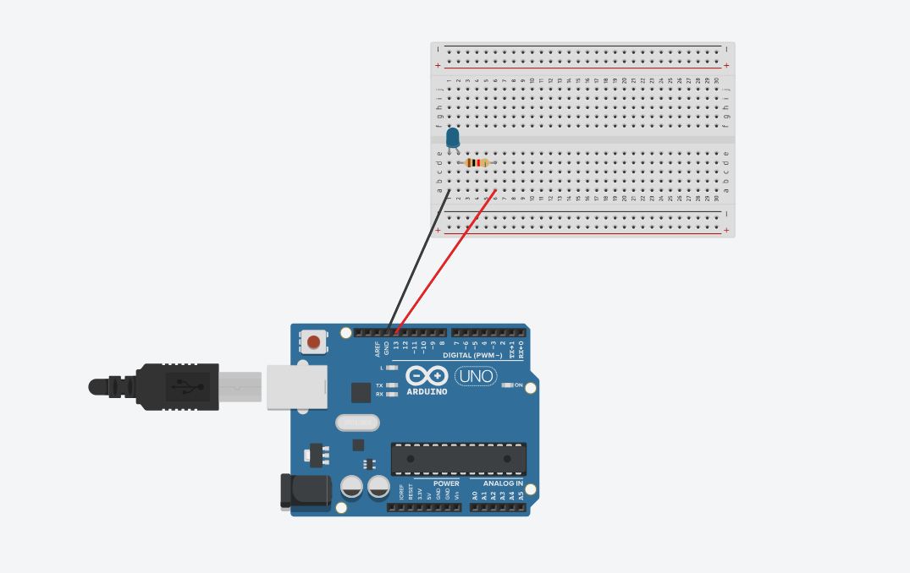
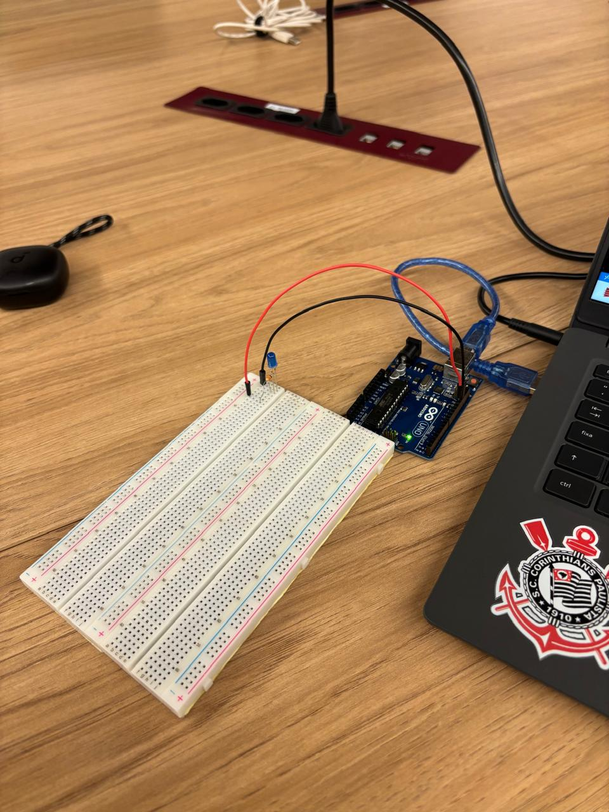

# Parte 2 — Blink LED Externo 

Este diretório contém o sketch usado na simulação do Tinkercad para piscar um LED externo no pino 13 com `delay(99)`.

- Arquivo principal: `blink_led_externo.ino`
- Link do Tinkercad (público): https://www.tinkercad.com/things/l6q5RAhgf2R/
- Evidências: Na pasta `assets/` estão fotos e vídeos (simulação e placa).

## Código

Consulte o arquivo `.ino` deste diretório.

## Montagem 
- LED off-board em protoboard (ânodo no pino 13 via jumper; cátodo ao GND via resistor 220–330 Ω).
- Arduino UNO + protoboard + resistor + jumpers.

## Estrutura

```
Parte2_BlinkExterno/
├── blink_led_externo.ino
├── README.md
└── assets/
    ├── foto_led_apagado_externo.jpg
    ├── foto_led_externo_simulacao.png
    ├── foto_led_piscando_externo.jpg
    ├── video_led_externo.mp4
    └── video_led_externo_simulacao.mp4
```

## Evidências (links)

<div align="center">
<sub>Imagem 03: Simulação Tinkercad — LED externo.</sub>

<sup>Fonte: Material produzido pela equipe, 2025.</sup>
</div>

<div align="center">
<sub>Imagem 04: LED externo (hardware) — apagado.</sub>

<sup>Fonte: Material produzido pela equipe, 2025.</sup>
</div>

<div align="center">
<sub>Imagem 05: LED externo (hardware) — aceso (piscando).</sub>

<sup>Fonte: Material produzido pelo autor, 2025.</sup>
</div>

<div align="center">
<sub>Vídeo 02: Simulação — LED externo piscando.</sub>
<a href="./assets/video_led_externo_simulacao.mp4">Assistir ao vídeo (MP4)</a>
<sup>Fonte: Material produzido pelo autor, 2025.</sup>
</div>

<div align="center">
<sub>Vídeo 03: Hardware — LED externo piscando.</sub>
<a href="./assets/video_led_externo.mp4">Assistir ao vídeo (MP4)</a>
<sup>Fonte: Material produzido pelo autor, 2025.</sup>
</div>

