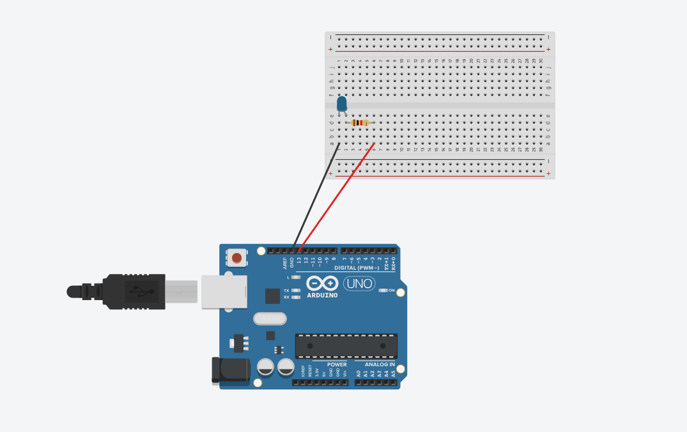
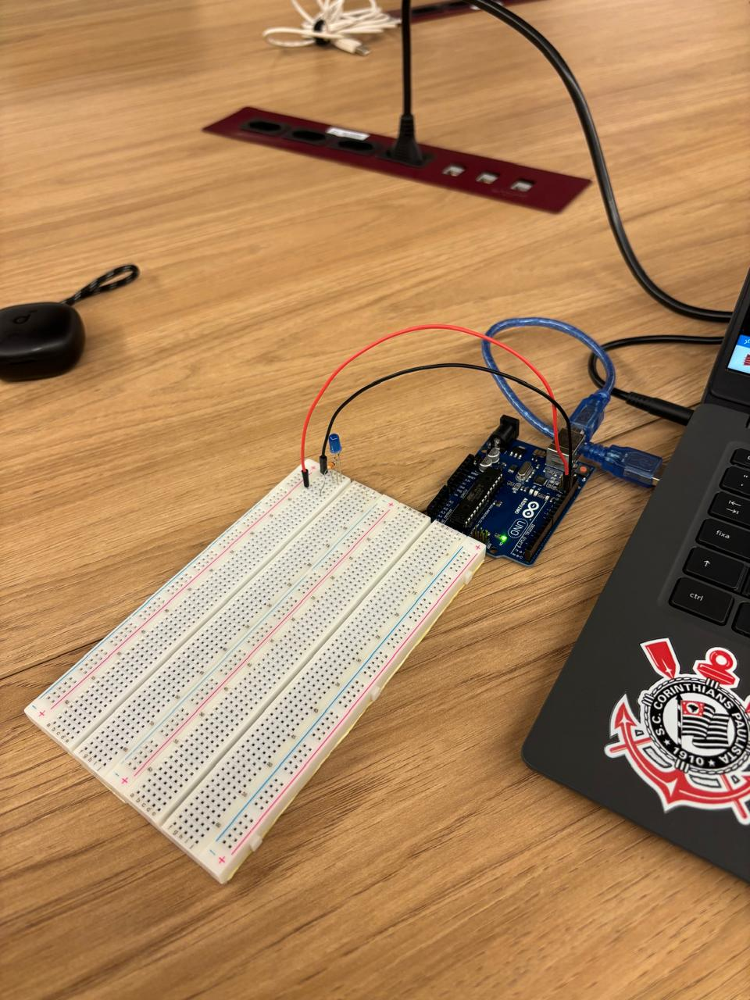
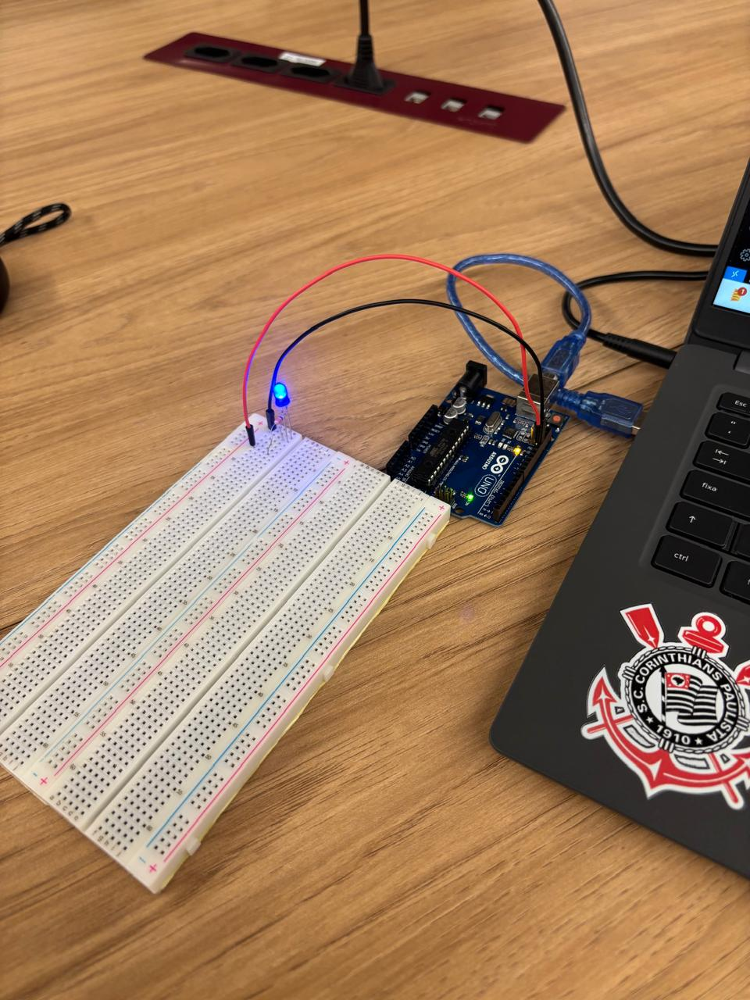

# Ponderada 1 — Blink LED (Parte 1 e Parte 2)

Aluno: Matheus Henrique Scapolan Silva

Ateliê 4 - Módulo 4

---

## Sumário

1. [Introdução](#1-introdução)
2. [Objetivos do projeto](#2-objetivos-do-projeto)
3. [Materiais e ferramentas](#3-materiais-e-ferramentas)
4. [Parte 1 — Blink LED Interno](#4-parte-1--blink-led-interno)
   - [4.1 Descrição da atividade](#41-descrição-da-atividade)
   - [4.2 Motivação (por-que-fazer-desta-forma)](#42-motivação-por-que-fazer-desta-forma)
   - [4.3 Passo a passo detalhado (instalação, conexão, upload)](#43-passo-a-passo-detalhado-instalação-conexão-upload)
   - [4.4 Código comentado](#44-código-comentado)
   - [4.5 Testes e evidências](#45-testes-e-evidências)
5. [Parte 2 — Simulação Blink Externo (Tinkercad)](#5-parte-2--simulação-blink-externo-tinkercad)
   - [5.1 Descrição da atividade](#51-descrição-da-atividade)
   - [5.2 Motivação (por que usar Tinkercad e LED off-board)](#52-motivação-por-que-usar-tinkercad-e-led-off-board)
   - [5.3 Passo a passo detalhado (montagem, configuração e execução)](#53-passo-a-passo-detalhado-montagem-configuração-e-execução)
   - [5.4 Código comentado (versão usada)](#54-código-comentado-versão-usada)
   - [5.5 Verificação, testes e evidências](#55-verificação-testes-e-evidências)
6. [Organização do repositório GitHub (estrutura e instruções git)](#6-organização-do-repositório-github-estrutura-e-instruções-git)
7. [Conclusão](#7-conclusão)
8. [Anexos](#8-anexos)
   - [A. Checklists de verificação](#a-checklists-de-verificação)
   - [B. Referências e links úteis](#b-referências-e-links-úteis)

---

## 1. Introdução

Este documento reúne a documentação para as atividades "Parte 1 — Blink LED Interno" e "Parte 2 — Simulando Blink Externo". O objetivo é fornecer um guia cobrindo desde a motivação pedagógica até o passo a passo prático, código comentado e evidências exigidas pela ponderada.

---

## 2. Objetivos do projeto

- Entender conceitos básicos de eletrônica e programação embarcada: pinos digitais, entrada/saída, alimentação e resistência de corrente.
- Aprender a usar a Arduino IDE para programar uma placa Arduino real (Parte 1).
- Aprender a usar o Tinkercad Circuits para simular circuitos com Arduino e componentes off-board (Parte 2).
- Produzir evidências documentadas (código, imagens e vídeo) aprováveis para submissão acadêmica.

---

## 3. Materiais e ferramentas

### Materiais (parte 1 — hardware real)
- Arduino UNO
- Cabo USB (A–B ou micro/USB conforme a placa)
- Computador com Arduino IDE instalado

### Materiais (parte 2 — simulação e hardware real)
- Projeto de circuito Tinkercad
- LED off-board (móvel)
- Protoboard
- Resistores de 1000 Ω
- Jumpers (fios)

### Ferramentas de software
- Arduino IDE
- Navegador (Chrome/Edge/Firefox) para Tinkercad
- Git (instalado localmente) e conta no GitHub
- Ferramenta de gravação de tela (para gerar vídeo de evidência)

---

## 4. Parte 1 — Blink LED Interno

### 4.1 Descrição da atividade
Na parte 1, foi feito um programa para controlar o LED interno da placa Arduino para que ele acenda por um tempo X, apague por um tempo Y e repita em loop. A atividade foi realizada em hardware real: a placa conectada ao computador via USB e programada pela Arduino IDE.

### 4.2 Motivação
- O LED interno serve como primeiro contato com programação embarcada: não há necessidade de montar circuitos externos.
- É um exercício clássico que introduz conceitos fundamentais aplicáveis a circuitos reais.

### 4.3 Procedimento executado

A execução foi realizada em hardware real, utilizando a [Arduino IDE](https://www.arduino.cc/en/software). A placa foi conectada via USB e reconhecida pela IDE.

O seguinte sketch foi utilizado e carregado na placa:

```cpp
// Blink LED Interno - Parte 1

void setup() {
  pinMode(LED_BUILTIN, OUTPUT);  // Define o LED interno como saída
}

void loop() {
  digitalWrite(LED_BUILTIN, HIGH);  // Acende o LED interno
  delay(1000);                      // Espera 1 segundo
  digitalWrite(LED_BUILTIN, LOW);   // Apaga o LED
  delay(1000);                      // Espera 1 segundo
}
```

O upload concluiu com sucesso e observou-se o LED interno piscando com intervalo de 1 segundo ligado e 1 segundo desligado.

### 4.4 Código

```cpp
// Blink LED Interno - Parte 1

void setup() {
  pinMode(LED_BUILTIN, OUTPUT);  // Define o LED interno como saída
}

void loop() {
  digitalWrite(LED_BUILTIN, HIGH);  // Acende o LED interno (nível lógico alto)
  delay(1000);                      // Pausa a execução por 1000 ms (1 segundo)
  digitalWrite(LED_BUILTIN, LOW);   // Desliga o LED interno (nível lógico baixo)
  delay(1000);                      // Pausa de 1 segundo antes do próximo ciclo
}
```

- `setup()`: executada uma vez quando a placa é inicializada.
- `pinMode(LED_BUILTIN, OUTPUT)`: configura o pino do LED interno como saída digital.
- `loop()`: roda continuamente após o `setup()`.
- `digitalWrite(pin, HIGH/LOW)`: escreve valor lógico no pino.
- `delay(ms)`: pausa a execução por `ms` milissegundos.

### 4.5 Evidências

<div align="center">
<sub>Imagem 01: LED interno — apagado.</sub>

<sup>Fonte: Material produzido pelo autor, 2025.</sup>
</div>

<div align="center">
<sub>Imagem 02: LED interno — aceso (piscando).</sub>

<sup>Fonte: Material produzido pelo autor, 2025.</sup>
</div>

<div align="center">
<sub>Vídeo 01: LED interno piscando.</sub>
<a href="./Arduino_Blink/Parte1_BlinkInterno/assets/video_led_interno.mp4">Assistir ao vídeo (MP4)</a>
<sup>Fonte: Material produzido pelo autor, 2025.</sup>
</div>

---

## 5. Parte 2 — Simulação Blink Externo (Tinkercad e hardware real)

### 5.1 Descrição da atividade
Foi realizada a montagem e simulação de um circuito com LED off-board conectado ao Arduino no Tinkercad Circuits, observando o correto funcionamento do piscar do LED.

### 5.2 Motivação
- Tinkercad permite simular sem hardware físico.
- LED off-board ensina protoboard, polaridade e resistor limitador de corrente.

### 5.3 Procedimento de simulação realizado

No Tinkercad Circuits, foi criado um circuito com Arduino UNO, protoboard, LED off-board, resistor de 1000 Ω e jumpers. O ânodo do LED foi conectado ao pino 13 e o cátodo ao GND por meio do resistor.

O seguinte sketch foi utilizado na simulação:

```cpp
// Blink LED Externo - Parte 2

int ledPin = 13;  // LED conectado ao pino digital 13

void setup() {
  pinMode(ledPin, OUTPUT);  // Define o pino 13 como saída
}

void loop() {
  digitalWrite(ledPin, HIGH);  // Liga o LED
  delay(99);                   // Espera 99 ms
  digitalWrite(ledPin, LOW);   // Desliga o LED
  delay(99);                   // Espera 99 ms
}
```

A simulação foi executada com sucesso, observando-se o LED externo piscando a cada 99 ms.

### 5.4 Código

```cpp
// Blink LED Externo - Parte 2

int ledPin = 13;  // Define o pino digital 13 como o pino do LED externo

void setup() {
  pinMode(ledPin, OUTPUT);  // Configura o pino do LED como saída
}

void loop() {
  digitalWrite(ledPin, HIGH);  // Acende o LED externo (nível lógico alto)
  delay(1000);                 // Pausa a execução por 1000 ms (1 segundo)
  digitalWrite(ledPin, LOW);   // Desliga o LED externo (nível lógico baixo)
  delay(1000);                 // Pausa de 1 segundo antes do próximo ciclo
}
```

- `int ledPin = 13:` declara uma variável que armazena o número do pino digital onde o LED externo está conectado.

- `setup():` executada uma vez quando a placa é inicializada.

- `pinMode(ledPin, OUTPUT):` configura o pino do LED externo como saída digital.

- `loop():` roda continuamente após o `setup().`

- `digitalWrite(pin, HIGH/LOW):` envia nível lógico alto (5V) para acender o LED e nível lógico baixo (0V) para apagá-lo.

- `delay(ms):` pausa a execução por `ms` milissegundos.

### 5.5 Evidências (links)

<div align="center">
<sub>Imagem 03: Simulação Tinkercad — LED externo.</sub>

<sup>Fonte: Material produzido pela equipe, 2025.</sup>
</div>

<div align="center">
<sub>Imagem 04: LED externo (hardware) — apagado.</sub>

<sup>Fonte: Material produzido pela equipe, 2025.</sup>
</div>

<div align="center">
<sub>Imagem 05: LED externo (hardware) — aceso (piscando).</sub>

<sup>Fonte: Material produzido pela equipe, 2025.</sup>
</div>

<div align="center">
<sub>Vídeo 02: Simulação — LED externo piscando.</sub>
<a href="./Arduino_Blink/Parte2_BlinkExterno/assets/video_led_externo_simulacao.mp4">Assistir ao vídeo (MP4)</a>
<sup>Fonte: Material produzido pela equipe, 2025.</sup>
</div>

<div align="center">
<sub>Vídeo 03: Hardware — LED externo piscando.</sub>
<a href="./Arduino_Blink/Parte2_BlinkExterno/assets/video_led_externo.mp4">Assistir ao vídeo (MP4)</a>
<sup>Fonte: Material produzido pela equipe, 2025.</sup>
</div>

---

## 6. Organização do repositório GitHub

Estrutura proposta:

```
Arduino_Blink/
├── Parte1_BlinkInterno/
│   ├── blink_led_interno.ino
│   ├── README.md
│   └── assets/
│       ├── foto_led_apagado_interno.jpg
│       ├── foto_led_piscando_interno.jpg
│       └── video_led_interno.mp4
│
└── Parte2_BlinkExterno/
    ├── blink_led_externo.ino
    ├── README.md
    └── assets/
        ├── foto_led_apagado_externo.jpg
        ├── foto_led_externo_simulacao.png
        ├── foto_led_piscando_externo.jpg
        ├── video_led_externo.mp4
        └── video_led_externo_simulacao.mp4
```

---

## 7. Conclusão

As atividades de Blink (interno e externo) introduzem bases de eletrônica e programação embarcada, uso da IDE, simulação e organização de repositório com evidências.

---

## 8. Anexos

### B. Referências e links úteis
- Arduino IDE: https://www.arduino.cc/en/software
- Tinkercad Circuits: https://www.tinkercad.com/circuits